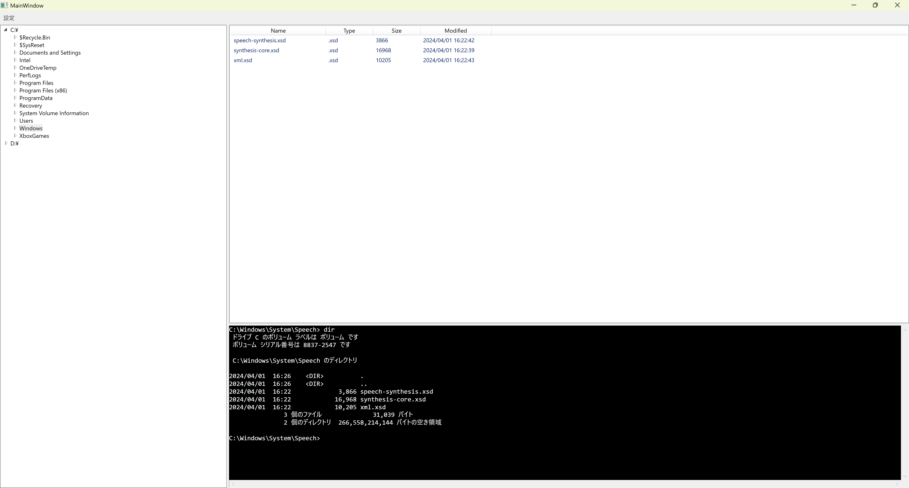

# ExpansionExplorer

## 目的
普段の業務を行う時、エクスプローラーとターミナルが連動するソフトがあると作業がはかどる場面があるのではないかと思い、ユーザーが選択したフォルダやファイルをカレントディレクトリに自動で更新してくれるターミナルが結合したエクスプローラーを作成しました。

## 起動方法
- ビルド成果物の「GUIExplorer.WPF.exe」を実行してください。

## 使い方
- 画面左に有効なドライブの一覧が表示されます。
  - 各ドライブ内にあるフォルダやファイルが表示されます。
- 画面右下に、コマンド実行可能なターミナルが表示されます。
  - 初期のカレントディレクトリは、「C:\Users\ユーザー名」です。
- 画面右上に、選択したフォルダ内にあるフォルダとファイルの一覧が表示されます。
  - ターミナルのカレントディレクトリは、選択したフォルダまたはファイルがあるパスに自動で更新されます。

